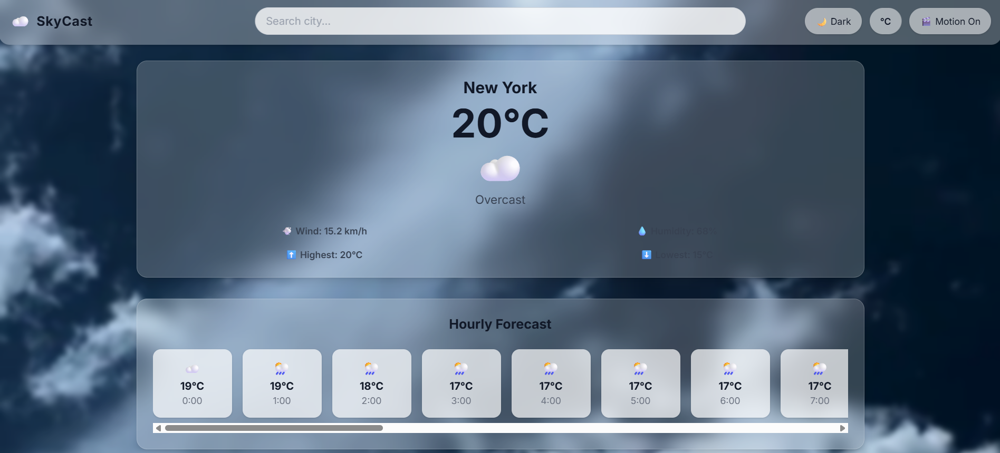
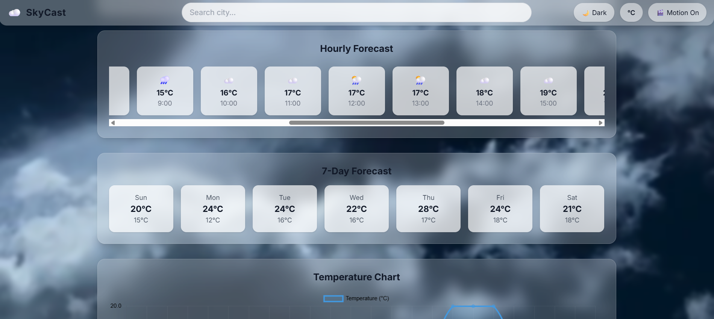
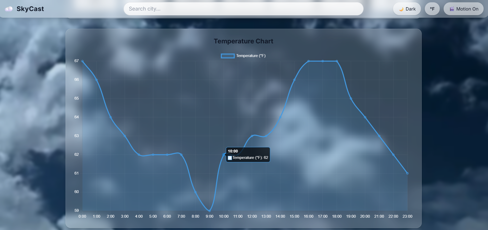
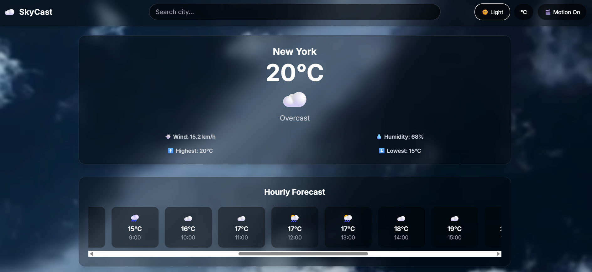

# ☁️ Interactive Weather app SkyCast using React

<p align="center">
  
</p>

            [](https://interactive-weather-app-psi.vercel.app/) 

A sleek, animated weather application built with **React**, **Framer Motion**, and **Chart.js**.  
SkyCast provides **real-time weather updates**, **hourly & daily forecasts**, and **dynamic backgrounds** that adapt to the weather conditions.

---

## 🔗 Live Demo

👉 **[Click here to try SkyCast](https://interactive-weather-app-psi.vercel.app/)**  

---

## ✨ Features

- 🌍 **City Search with Suggestions**  
  Search any city with instant suggestions powered by **Nominatim** (OpenStreetMap).

- 📍 **Geolocation Support**  
  Detects your current location automatically on first load.

- 🌦 **Live Weather Data**  
  Powered by the **Open-Meteo API**, including:
  - Current weather
  - Hourly forecast
  - 7-day forecast

- 🎨 **Dynamic Weather Backgrounds**  
  Animated video backgrounds (sunny, cloudy, rainy, snow, etc.) with motion toggle.

- 🌙 **Dark Mode & Light Mode**  
  Seamless theme switching with one click.

- 🌡 **Unit Conversion**  
  Toggle between °C and °F instantly.

- 📊 **Interactive Weather Chart**  
  Line graph for 24-hour temperature trend using **react-chartjs-2**.

- 🌀 **Smooth Animations**  
  UI powered by **Framer Motion** for fluid transitions.

---

## 📸 Screenshots

### Current Weather:



### Hourly & Dialy Forecast:



### Weather Chart:

 

### Dark Mode:



---

## 🛠️ Tech Stack

- **React** (Vite / CRA)
- **Framer Motion** (animations)
- **Chart.js + react-chartjs-2** (temperature charts)
- **TailwindCSS** (styling + glassmorphism UI)
- **Axios** (API requests)
- **Open-Meteo API** (weather data)
- **Nominatim API** (city search + autocomplete)

---

## 🚀 Getting Started

### 1️⃣ Clone the repository

```bash
git clone https://github.com/Sagarika311/skycast-react.git
cd skycast-react
````

### 2️⃣ Install dependencies

```bash
npm install
```

### 3️⃣ Run the development server

```bash
npm run dev
```

### 4️⃣ Build for production

```bash
npm run build
```

---

## ⚙️ Configuration

* Default city is set to **New York**.
* Preset cities: Delhi, Mumbai, Bengaluru, London, Tokyo, Paris.
* You can update presets in [`src/utils/cityCoords.js`](src/utils/cityCoords.js).

---

## 📝 License

This project is licensed under the **MIT License**.
Feel free to use, modify, and distribute it.

---

## 💡 Acknowledgments

* 🌤 [Open-Meteo](https://open-meteo.com/) for free weather data
* 🗺 [Nominatim](https://nominatim.org/) for geocoding & search

```
